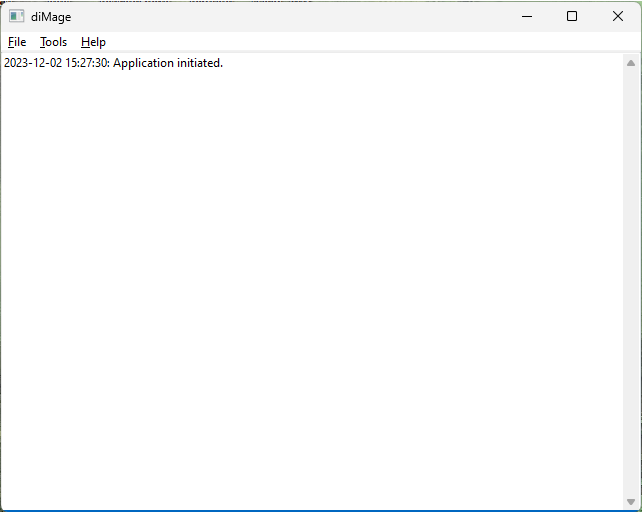
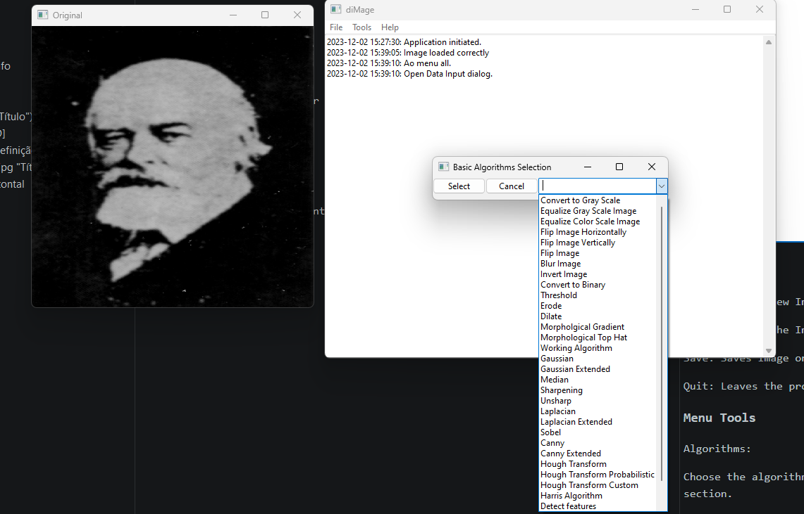

# dImage Image Processing Manual

## Introduction

This project is my attempt to blend OpenCV and WxWidgets and to re-learn Image Processing and at the same time, get more proficient on both libs.

When I was in college I had a, hmm, I have no idea if this exists in USA or UK or outside of Brazil. Basically, I was paid to do a research while being an undergraduate student. So, my research was in Image Processing, especifically for x-ray scans of mamographies.

My major was Electrical Engineering - electronics- but I did and I still don't like it.

Because of this research I learned Delphi and C.
- I had access to the internet ( around 1996-1998 )
- I used a lot of IRC.
- I was part of many mailing lists.
- So, you can tell that besides all the math I learned, boolean logic, pascal and assembly, I own my career in great part to this.

Back to reality however, this is how I have fun. It is mostly a hobby project just like some people do carpentry or gardening. Back in 1996 I had no idea if OpenCV existed or about libraries.

**This application is the one I wish I had written back in 1996.**

## General Interface

****

### Menu file

Open: Opens a new Image

Close: Closes the Image

Save: Saves Image only after processing

Quit: Leaves the program

### Menu Tools

**Algorithms: **

Choose the algorithm you want to apply to your image. More details in the next section.

****

**Kernel:**

Allows the user to apply a custom kernel ( 3x3 up to 13x13), only odd kernel sizes are allowed.

**Revert:**

Simply reverts the last algorithms applied to the image.

## Algorithms

The idea behind this tool is to allow a student of Image Processing to apply algorithms without having to do anything. Of course, I recommend using Scilab:

https://www.scilab.org

By the way, don't use Matlab.

If you want to learn image processing, there are several sites on the internet that explain it but I added a few pdfs that explain it in details. All these documents are either written by me or are free to use: the documents state the authors and where they were placed for download.

- Image Processing Fundamentals--An Overview.pdf
- Image Processing.pdf
- MAths_IM_DEBLUR_ENH_SD_EDT_2016.pdf
- Processamento-de-Images.pdf (*)
- Rita-Tutorial-PDI.pdf
- Segmentacao.pdf (*)
- fip.pdf
- review.PDF
- wavellets.pdf (*)

**(*) written by me in Portuguese**

The sources for them are:

https://www.ogemarques.com
http://www.cse.iitm.ac.in/~vplab/courses/optimization/MAths_IM_DEBLUR_ENH_SD_EDT_2016.pdf
https://farid.berkeley.edu/downloads/tutorials/fip.pdf
http://www.dsc.ufcg.edu.br/~hmg/disciplinas/graduacao/vc-2014.1/Rita-Tutorial-PDI.pdf
https://imageprocessingplace.com/downloads_V3/root_downloads/tutorials/Image%20Processing%20Fundamentals--An%20Overview.pdf

### Books

**"Digital Image Processing An Algorithmic Introduction Using Java"**

Authors: Wilhelm Burger and Mark J. Burge

**"Processamento Digital de Imagens"**

Authors: Ogê Marques Filho and Hugo Vieira Netov

**"OpenCV 3 Computer Vision Application Programming Cookbook", Third Editio**n

Author: Robert Laganiere

The first two I used to relearn Image Processing.
The last one was very helpful for some OpenCV receipts.

https://zlogdan.wordpress.com

Powered by https://opencv.org
Powered by https://www.wxwidgets.org

